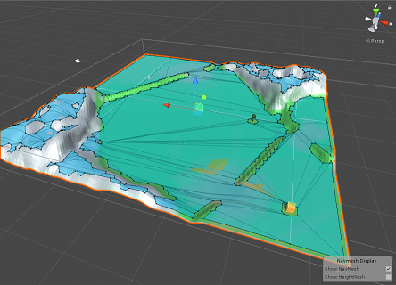

[Home](index.md)

# RTS Devlog
    

## Idea 💡
The idea is to make a multiplayer Real Time Startegy game inspired in my favorite games, like: Age of Empires, Imperium, Sparta, Battle for the Middle Earth, Praetorians, Civilization, Starcraft...

Scroll down to the [comments section](#comments) and let me know what you think!

## Log 📰
### New terrain navigation - 8/8/2019
In the last posts I've shown some units that can move in a plane, that's possible thanks to the navigation tools provided by Unity. But I need something different so I have spent some time testing scripts that can bake the NavMesh surface during runtime, which means that the available walk space is affected by new buildings and the units will avoid that structure if it's in their path instead of going through it 😅.

Then I modeled a simple terrain (1 vs 1) in Blender with a low poly style. After some bug fixes and smashing my keyboard a couple times, this is the resulting navigation mesh surface that can be re-baked during runtime. The baking process can make the game a bit laggy sometimes but idk why 🤔. Still a lot to do but I consider this a milestone without a doubt.

 

#### Barracks model (Rome)
First attempt with the roman barracks, this is where the roman soldiers will be trained. I'm making these fast models only for testing, this is not the final result. All the graphics will be improved later on.

#### Possible name for the game
Last three weeks so many names for the project/game came into my mind. Thinking about the main aspect of the game -*having several civilizations from different **places** and moments of the **time***- I liked "**Anachrony**".

That's all for now 💙.

* * *
### Romans planification and wheat farm - 2/8/2019
Hi there! I've been thinking about the first faction to implement into the game and finally I've decided that the **Roman** civilization is the best one to start. This civ will be very standard, with close combat and mid-range units (no cavalry). Here's a diagram with the structures and units that I have in mind at the moment, the light-blue diamonds represent that a structure is made with that unit and the dark ones indicate which units can be trained in a specific building. Of course, this is only the first approach into this civ planification, but everything has a start.

Each civilization will have **three main resources**:
- Monetary/material resource 💰. Used to build structures and train units.
- Food 🍞. Used to train units and consumed by soldiers.
- Population 👩‍👩‍👦‍👦. Current population and limit (increasable with a specific structure like houses).

#### Working on the Wheat Field (Rome)

I started designing in Blender some wheat with the thought to repeat that single mesh in order to make a hole field but I didn't like the result (left), so I restarted the model again with a more simplistic aproach (right). I made each row of "wheat" an independent object to control the position.

 

After importing the model into Unity I added to it the base structure prefab that I have (building behavior, particle effect, health bar...) and then animated each row of wheat. In this example this field produces 20 units of food per second.

That's all for now, have a nice day! 😊

* * *
### First post! - 31/7/2019
I've been working in this project now for two weeks and I'm learning so many things. It's not my first Unity project but it's the first one that I'm very exited with (pretty ambitious though).

Right now I'm focused in the main aspects of the game, like building structures and the movement of the units so everything is made out of cubes and spheres, the cool graphics will come later. 

Here's the **builder** unit, when you click on it all the buildings that it can create will appear at the bottom of the screen. Then, the structure that you select will follow your mouse on the plane and with another click it gets placed down with a small particle effect. Both objects have a health bar on top that follows the camera view.

You cannot build in the space of another structure. The one that you're trying to create turns red and it's not buildable. Currently the structures cannot rotate during the build process but they will.

Here's a test with a **laser soldier** unit, when another unit with different team number enters in the attack range of the unit a laser appears dealing some damage per second.

With this basic structure and units I'm now planning to implement two factions. The idea is to have several civilizations from different moments of the history combined. For example, the romans vs some random futuristic civ.

##  Comment and get a cookie 🍪!
Any feedback will be appreciated.

<noscript>Please enable JavaScript to view the <a href="https://disqus.com/?ref_noscript" rel="nofollow">comments powered by Disqus.</a></noscript>
