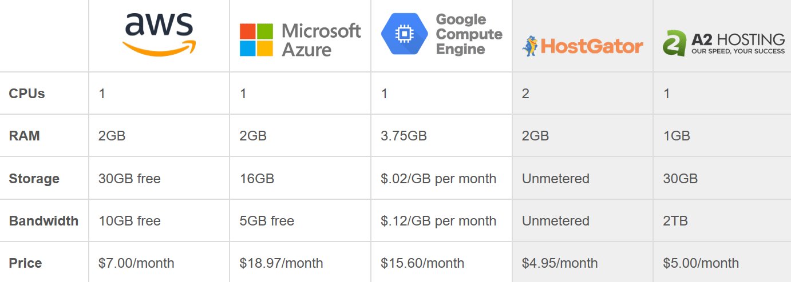
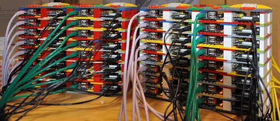

[Home](../index.md)

# Is it worth it to build a home cluster?
 

The internet is full with people creating their own custom cluster computers at home as a personal project or with a specific objective like: testing parallel programs, having your own web server or file storage system, mining bitcoins... But nowadays there are available powerful web services like Azure, AWS or Google Cloud on which we can run parallel programs, train CNNs or anything we want . So the question is, **is it worth it to create a home cluster from scratch instead of using these alternatives?**

Well, in short, **it depends** but the most likely option is that a cloud computing option is going to be the most feasible choice. Nowadays it’s no longer a question of whether you should move to the cloud or not, it’s a matter of which platform to use since there are many options available that also provide free trials for testing.

## Comparing alternatives
The three big in the public cloud computing industry: AWS, Azure and Google Cloud. With cloud computing, you are basically establishing a distributed architecture at a remote or virtual facility.  You don't need to buy any hardware or networking, instead, you can rent  the processing power you need (the most basic pack).

[This article](https://www.hostingadvice.com/how-to/aws-azure-google-cloud-alternatives/) posted on august 12 shows an interesting comparison between these alternatives considering the resources that beginners or startups would need.

For AI developers there's also **Google Colab**, Google's free cloud service for deep learning applications. Google Colab works as a Jupyter environment and is already equipped with Python and popular libraries such as Keras,
TensorFlow, PyTorch, and OpenCV; moreover it has the free option to use a GPU for your training experiments. This is a very good option for small deep learning experiments or research, but keep in mind that it has an idle cut-off so you need to be present for long tasks. Hardware specifications of the Google Colab :

- n1-highmem-2 instance
- Intel(R) Xeon(R) CPUs 1 core hyper threaded @ 2.3GHz, 45MB Cache
- ~13GB GDDR5  VRAM
- ~320GB Disk space
- idle cut-off 90 minutes (maximum 12 hours)
- GPU Tesla K80

## Low cost cluster
Talking about getting the most with a low cost (only considering the cost of the hardware), here's where single board computers are a very interesting option to consider.

There are people building [*High Performance* Parallel Personal Clusters](https://hackaday.com/2016/05/09/designing-a-high-performance-parallel-personal-cluster/) with around €500 in off-the-shelf electronics and getting significantly faster results at computationally demanding problems than a single, fast desktop processor.

#### Written with 💙 by [GuilleQP](../index.md)

* * *
## Leave a comment and get a cookie 🍪!
TODO

<noscript>Please enable JavaScript to view the <a href="https://disqus.com/?ref_noscript" rel="nofollow">comments powered by Disqus.</a></noscript>