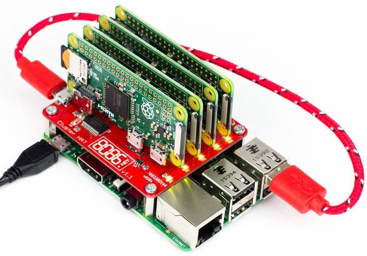

[Home](../index.md)

# Is it worth it to build a home cluster?
 

The internet is full with people creating their own custom cluster computers at home as a personal project or with a specific objective like: testing parallel programs, having your own web server or file storage system, mining bitcoins... But nowadays there are available powerful web services like Azure, AWS or Google Cloud on which we can run parallel programs, train CNNs or anything we want . So the question is, **is it worth it to create a home cluster from scratch instead of using these alternatives?**

Well, in short, **it depends** but the most likely option is that a cloud computing option is going to be the most feasible choice. Nowadays it’s no longer a question of whether you should move to the cloud or not, it’s a matter of which platform to use since there are many options available that also provide free trials for testing. Nevertheless it's a very good project to create your own cluster as a research in the parallel computing field or just to have some fun, we'll get to that later.

By the middle of the 1990’s there was a move away from shared memory computing towards distributed cluster computing. 

## Comparing alternatives
The **three big** in the public cloud computing industry are: AWS, Azure and Google Cloud. With cloud computing, you are basically establishing a distributed architecture at a remote or virtual facility. You don't need to buy any hardware or networking, instead, you can rent  the processing power you need.

[This article](https://www.hostingadvice.com/how-to/aws-azure-google-cloud-alternatives/) posted on 12/08/2019 shows an interesting comparison between these alternatives considering the resources that beginners or startups would need (the most basic pack).

For AI developers there's also **Google Colab**, Google's free cloud service for deep learning applications. Google Colab works as a Jupyter environment and is already equipped with Python and popular libraries such as Keras,
TensorFlow, PyTorch, and OpenCV; moreover it has the free option to use a GPU for your training experiments. This is a very good option for small deep learning experiments or research, but keep in mind that it has an idle cut-off so you need to be present for long tasks. Hardware specifications of the Google Colab :

- n1-highmem-2 instance
- Intel(R) Xeon(R) CPUs 1 core hyper threaded @ 2.3GHz, 45MB Cache
- ~13GB GDDR5  VRAM
- ~320GB Disk space
- idle cut-off 90 minutes (maximum 12 hours)
- GPU Tesla K80

## Low cost cluster
If your needs doesn't stick to what cloud computing services offer you, or you're definitely going to build a cluster at your home no matter what, then let's analyze the options.

Talking about getting the most with a low cost (only considering the cost of the hardware), here's where single board computers are a very interesting option to consider. There are people building [*High Performance* Parallel Personal Clusters](https://hackaday.com/2016/05/09/designing-a-high-performance-parallel-personal-cluster/) with around €500 in off-the-shelf electronics and getting significantly faster results at computationally demanding problems than a single, fast desktop processor.

The cheapest and most compact way to build a cluster that I've found is the [Cluster HAT](https://clusterhat.com/). This board is capable of holding up to 4 Pi Zeros using your own RPi as the main controller. You can get this board for ~34€, adding the cost of a Raspberry Pi 2 or 3 and four Raspberry Pi Zero boards.

### Single board computers options

|Board Name|CPU|Cores|GPU|Top RAM|Eth port|Max SD class|Power supply|Price|
|:--|:--:|:--:|:--:|:--:|:--:|:--:|:--:|:--:|
|Arduino Mega 2560|ATmega2560|-|-|256KB FlashROM|-|-|7-12V|~35€|
|RPi 4B|BCM2711B0 1.5GHz|quad-core|Broadcom VideoCore VI|4GB LPDDR4 SDRAM|Gb|10|5.1V/3.0A|59,95€|
|Banana Pi M64|Allwinner A64 1.2GHz|quad-core|Mali-400 MP2|2GB DDR3|Gb|10|5V/2A|63€|
|Tinker Board|RK3288|quad-core|ARM Mali-T764|2GB DDR3|Gb|U3|5V/3A|~80€|
|BeagleBoard-X15|TI AM5728|2×1.5-GHz|DualSGX544 532MHz|2GB DDR3L|2xGb|10|12V/5A|239$|
|Huawei HiKey 960|Kirin 960|4x2.3GHz A73 and 4x1.8GHz A53|Mali G71 MP8|3GB LPDDR4 SDRAM|-|10|12V/2A|299$|

Best option: RPi4. [Pico Cluster](https://www.picocluster.com/collections/raspberry-pi4)

## Some interesting projects

[Blockchain Signaling System](https://www.hackster.io/communication-systems-group-university-of-zurich/blockchain-signaling-system-b79968) They used 18 Tinker Boards to use blockchain for signaling DDoS attacks in a cooperative and distributed network defense.

Wikipedia has a [list of distributed computing projects](https://en.wikipedia.org/wiki/List_of_distributed_computing_projects)

Jeff Minard [home cluster](https://jrm.cc/blog/home-cluster-part-i-motivations/)

#### Written with 💙 by [GuilleQP](../index.md)

* * *
## Leave a comment and get a cookie 🍪!
What do you think? Are you going to build your own cluster?

<noscript>Please enable JavaScript to view the <a href="https://disqus.com/?ref_noscript" rel="nofollow">comments powered by Disqus.</a></noscript>