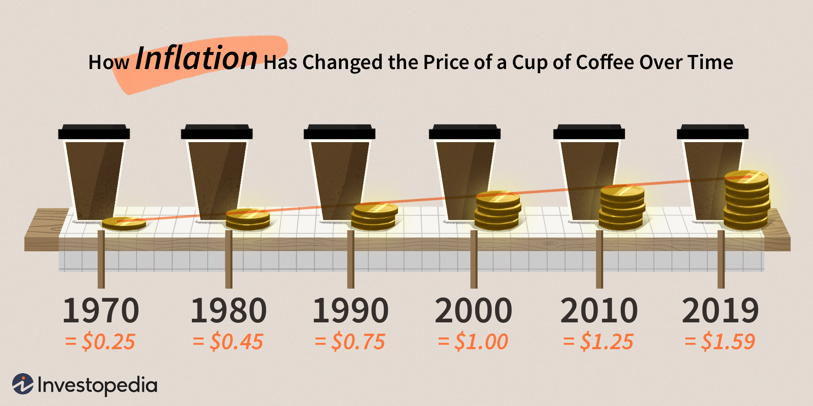
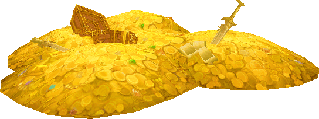
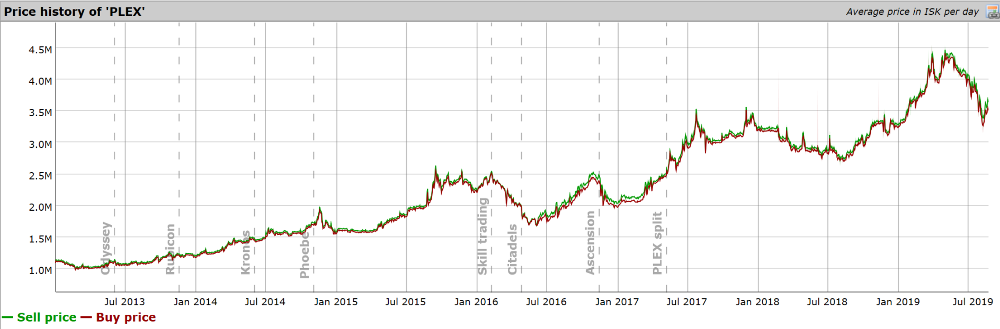

[Home](../index.md)

# Hyperinflation in videogames
 

Recently I entered in a Minecraft server with an economy plugin and the prices of the items had reached **millions**. One cobblestone block was worth 1.2M! I thought this was hilarious so today I will introduce you to the magnificent world of hyperinflation in videogames.

What is hyperinflation? How does it appear in videogames? What are the best solutions to avoid it in your games? I'll try to answer all this questions.

## What is hyperinflation?
>  Inflation is when you pay fifteen dollars for the ten-dollar haircut you used to get for five dollars when you had hair. - Sam Ewing 

Well, according to Google, it's a "monetary inflation occurring at a very high rate" (duh). So a more accurate question should be: What is inflation? Here's a good definition provided by Investopedia:

```Inflation is a quantitative measure of the rate at which the average price level of a basket of selected goods and services in an economy increases over a period of time. It is the constant rise in the general level of prices where a unit of currency buys less than it did in prior periods.```

This is a good example of how inflation appears in the real world due to many factors: producers can't make enough to meet demand (Demand-Pull inflation), goods shortage (Cost-Push inflation), etc.



As you can see, inflation indicates a **decrease** in the **purchasing power**, in this case using United States Dollars (USD). Basically, keep this idea in mind: inflation indicates that your money is less valuable over time.

I'm not going into details but here are some good real examples of hyperinflation that lead to catastrophic results in their respective countries:

- Hungary (Pengö) 1945-1946. Worst case of hyperinflation in history. 1 USD = 4.6×10^29 Pengö (460.000.000.000.000.000.000.000.000.000) [Read](https://www.businessinsider.com/hungarys-hyperinflation-story-2014-4?international=true&r=US&IR=T)
- Germany (German mark) 1922-2923. 1 USD = 4,210,500,000,000 DM [Read](https://mashable.com/2016/07/27/german-hyperinflation/?europe=true)
- Venezuela (Venezuelan Bolívar) 2016-now. I've included this one since it's very notorious right now. Top exchange: 1 USD = 15843 VES. [Read](https://en.wikipedia.org/wiki/Hyperinflation_in_Venezuela)
- Other examples [here](https://www.fleur-de-coin.com/articles/worthless-money).


### And in videogames?

Videogames currencies work different than real ones, so the inflation appears due to different aspects. It can be seen mostly in **MMOs** (Massive Multiplayer Online) because the economy of this games is very important and have to last over time. It's not the case with other games like real time strategy, for example League of Legends, because the money is only used in a single game and then disappears. If you are developing a videogame and you're planning to add an economy system, **be very careful matching your game genre**; in other words, don't use a in-game currency if you can avoid it and it's not necessary.

Inflation shows up on a videogame currency when players constantly gain in-game money directly from the system. That means that new money is "printed" every time a player kills a mob or completes a quest. When a player goes to a low-level area and kill creatures that's called *farming*. Imagine one player farming money to get that precious desired object, but, in the meantime you have hundreds of thousands of players earning money too. Probably you see now where this is going, there's too many people obtaining money so fast (out of nowhere) and once a player obtains the best objects in your game then the money left is worthless. So you end up with a pile of gold with no value (at least for you).



What are the **consequences**? Firstly, the prices of the goods in the players market will grow and new players will not be able to compete with them, then, the game devs will try to fix this by giving more money to the new players (print more money) making the problem even worse and finally, the players will stop using the in-game currency and swap to a barter system.

This is not just for MMOs, you can see the effects of hyperinflation in Minecraft servers with economy plugins, RPGs, online casinos... Basically every online game with a basic economic system.

## How to deal with it?
Knowing that a hyperinflation is bad and could cause massive damage to your game. Let's see how to prevent it and deal with it.

- **NPCs**

One possible solution is to introduce NPCs in your game for the players with special deals or objects, that way all the money spent on the items bought to these NPCs is "destroyed".

- **Link to real world money**

Eve Online does this with PLEX. you can buy PLEX with real money and then exchange it with other players to gain ISK (Eve Online money) or use it to increase your subscription time. This is a good solution but does not eradicate inflation completely. This chart shows the buy/sell price history per PLEX unit using ISK since 2013.



- **Control over the in-game currency creation**

If your game has a finite amount of money you have direct control over it so no hyperinflation should appear. But it's difficult to deal with a game with a specific currency sum.

- **Raise taxes**

In most of the games the players can trade stuff with the in-game currency between each other and with NPCs (Non-Playable Characters)

You have to be careful with this one because too much high taxes can lead your players to stop playing the game.


- Abandon the old currency and switch to a barter economy
- Increase the production of goods and services ¿?
- Add consumables (food) that cost money and you need more expensive food depending on your level of experience

wow active players 1.7 million oct 2018 [[1]](https://gadgets.ndtv.com/games/news/world-of-warcraft-wow-subscription-numbers-battle-of-azeroth-1932930)

http://meminsf.silverstringmedia.com/labour/a-history-of-world-of-warcrafts-gold-economy/

https://www.adam4eve.eu/commodity.php?typeID=44992&regionID=10000002&avg=0&from=2013-01-01&until=2019-08-24#

* * *
## Leave a comment and get a cookie 🍪!

<div id="disqus_thread"></div>
<script>
    (function() {  // REQUIRED CONFIGURATION VARIABLE: EDIT THE SHORTNAME BELOW
        var d = document, s = d.createElement('script');
        
        s.src = 'https://guilleqp.disqus.com/embed.js'; 
        
        s.setAttribute('data-timestamp', +new Date());
        (d.head || d.body).appendChild(s);
    })();
</script>
<noscript>Please enable JavaScript to view the <a href="https://disqus.com/?ref_noscript" rel="nofollow">comments powered by Disqus.</a></noscript>