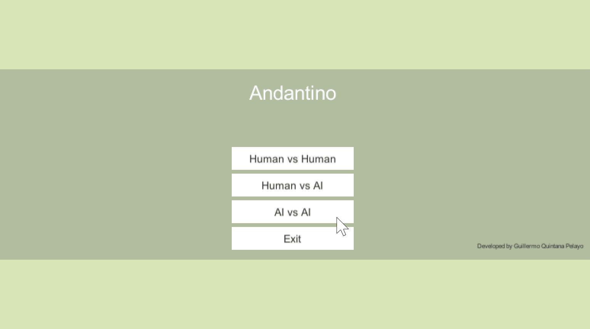
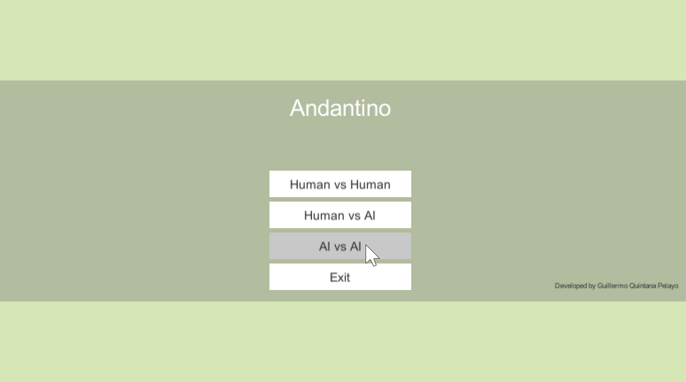

[Home](../index.md)

# AI approach to Andantino board game

  

## Introduction
[Andantino](http://www.di.fc.ul.pt/~jpn/gv/andantino.htm) is a board game originally created by David Smith in 1995. The aim of this project is to implement several 1vs1 AI algorithms and see which one performs better in this game. As a secondary objective, the best AI implemented should be capable of playing a full game against a human or another AI in less than 10 minutes.

## Implementing the Game
The chosen platform to implement the game is Unity 3D. The hexagonal board is constructed in a 10x10 grid, the original game is meant to be infinite but this restriction is helpful for an easier implementation. [Here](https://www.redblobgames.com/grids/hexagons/) is a very helpful web with info about hexagonal grids.

Three play options:
- Human vs human.
- Human vs AI.
- AI vs AI.

### Winning possibilities
There are two options to win the game, each one requires a different checking function, both for checking if the game has ended and also for the evaluation function to select the best following move (see next section).

#### Make 5 in a row of the same color
One player can win in this case making 5 in a row in three possible directions: vertical, / and \ .


#### Fully enclose one or more enemy stones inside 6 or more of his own stones
This surrounding strategy was particularly hard to implement. 

## Developing the AI
Once the basic game structure is ready, it's time to implement the AI algorithms. The first approach is a **random** algorithm to choose randomly between the possible actions for the next turn. It's helpful for testing the game.

```
RANDOM AI:
get possible moves for next turn
if there are not any possible move
    return
else
    select a random move between the possible ones
```



Before implementing any new algorithm an evaluation function is needed. This function should provide an integer value with the score for a specific move and is used in the exploration to know the values of the leaf nodes in the search tree.

```C#
int Evaluate(Hexagon h, int type){
        Tuple<bool,int> win = ctrTurns.CheckWin(h);
        if(win.Item1){
            if(type==0){
                return 1000;
            }
            return -1000;
        }else if(win.Item2 > 3){
            if(type==0){
                return 100;
            }
            return -100;
        }
        int r = Random.Range(-10,10);
        return r;
    }
```

MiniMax


## Testing


#### Developed with 💙 by [GuilleQP](../index.md)

* * *
## Leave a comment and get a cookie 🍪!
Do you know another possible solution for this? Write it down!

<div id="disqus_thread"></div>
<script>
    (function() {  // REQUIRED CONFIGURATION VARIABLE: EDIT THE SHORTNAME BELOW
        var d = document, s = d.createElement('script');
        
        s.src = 'https://guilleqp.disqus.com/embed.js'; 
        
        s.setAttribute('data-timestamp', +new Date());
        (d.head || d.body).appendChild(s);
    })();
</script>
<noscript>Please enable JavaScript to view the <a href="https://disqus.com/?ref_noscript" rel="nofollow">comments powered by Disqus.</a></noscript>