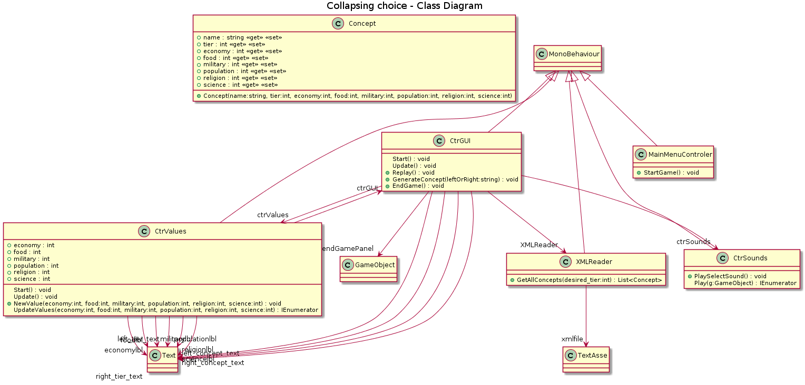

[Home](../index.md)

# Collapsing Choice
    

You can play the game [here](https://guilleqp.github.io/gamedev/collapsing_choice/index.html).

## Idea 💡
The player gets to choose between two concepts, the one it's chosen gets eradicated from existence. Everything that is erased from the world has an effect over one or several values (economy, population, food...). If any value reaches 0 then the world has collapsed.

## Implementation
First, I made a drawing with how I wanted the game to look like and the different values that indicate how close the player is to the world destruction. The final values are: economy, food, military, population, religion and science. Every concept needs a name, a tier indicator (to avoid unbalanced choices) and those values.

After that I made a XML format for each concept and a C# class to read that file (XMLReader). This is how the XML looks like:

It's easy to add new concepts and check the values to manually balance the game. I included 70 concepts with the help of [this](https://randomwordgenerator.com/) website that generates random words. The concepts are distributed in 5 tiers (from 0, easy; to 4, hard).

The concepts are randomly selected and then shown to the player. Every time the player makes a choice there's a 10% chance to upgrade the tier of the new concept so the choices are more tough (this also happens when there are no more concepts of the current tier). 

The endgame happens when a value indicator reaches 0 or when there's no more tier 4 concepts. Then the player can restart the game. It's a replayable game due to the randomness in the concept selection, so every time .

This is the final class diagram for the game, as you can see, there is a good amount of dependencies with the Unity Text class since it's mostly a text based game that works 100% in the game user interface (no 2D sprites).

## Final look
This is the starting scene of the game with the instructions to play.

The main game play scene has all the indicators with the current values and the two possible choices.

## Future work
The look of the game is very simple, so it could be highly improved. Another idea that could not be implemented is to have achievements and push-up notifications, for example: "X concept has survived 3 choices in a row, must be very important to you!", "You sure about that?", "Really?! You killed all the dogs?!"...

The values system is not clear, maybe could be improved with more info on what values will be affected with each choice before making it.

* * *
##  Comment and get a cookie 🍪!
Any feedback will be appreciated.

<noscript>Please enable JavaScript to view the <a href="https://disqus.com/?ref_noscript" rel="nofollow">comments powered by Disqus.</a></noscript>
