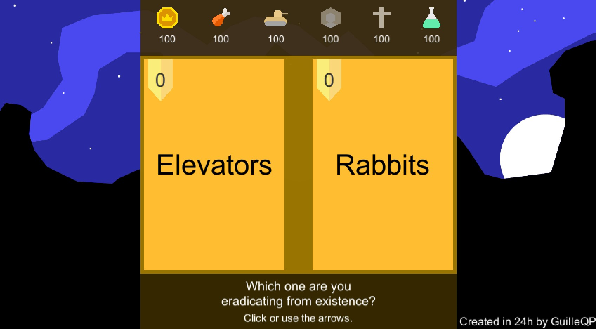

<link rel="shortcut icon" type="image/png" href="images/favicon.ico">

# Greetings!
Guillermo Quintana here 😄. I'm a CS Engineer specialized in computation and machine learning. This is a personal blog to keep track of all my projects ideas and thoughts.

* * *
## Projects ⚙
### **Daily reading list** 📰
List with interesting resources and news about computer science, artificial intelligence, economics, politics... The best way to start your day with a morning reading session. [Go to list](projects/daily_read.md)

## Articles 📚
### **Hyperinflation in videogames** 💸
28/08/2019

What is hyperinflation? How does it appear in videogames? What are the best solutions to avoid it in your games? [Continue reading...](articles/hyperinflation_in_videogames.md)

### **Automatic evaluation plug-in for Moodle** 
05/07/2019

This article presents a tool for the automatic evaluation of programming exercises which is integrated in the Moodle platform. It was presented at the JENUI 2019 congress.
[Link to full text](http://www.aenui.net/ojs/index.php?journal=actas_jenui&page=article&op=view&path%5B%5D=513)

## Game dev 🎮
I'm currently trying to make a **Real Time Strategy game** using Unity 3D and Blender. Here you have the detailed 👉[DEVLOG](gamedev/RTSdevlog.md).

<blockquote class="twitter-tweet" tw-align-center data-theme="light" data-link-color="#2B7BB9">
Hey there! I&#39;ve started a Game Dev 🎮blog in my web. Check it out and let me know in the comments what you think! 😊<a href="https://t.co/wyTwpCzNJF">https://t.co/wyTwpCzNJF</a>
&mdash; Guillermo Quintana (@Guille_qp) <a href="https://twitter.com/Guille_qp/status/1157370410511605760?ref_src=twsrc%5Etfw">August 2, 2019</a></blockquote> 

### Collapsing choice
29/09/2019

This is a web game I made in 24h. You have to decide what to eradicate from existence between two concepts every round, the decisions are more hard over time. You can play the game [here](gamedev/collapsing_choice/index.html). And [here](gamedev/collapsing_choice.md) is the complete devlog of the 24h of development.

* * *